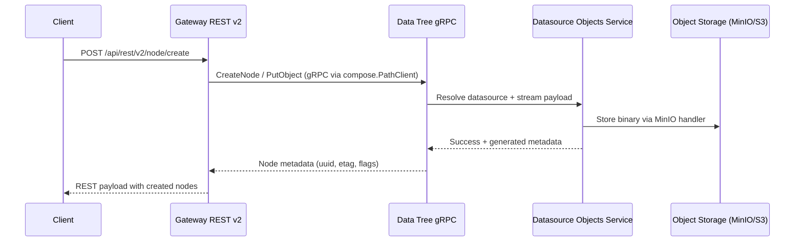
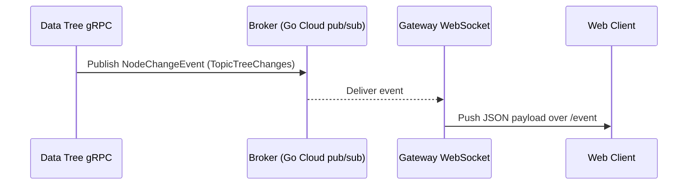
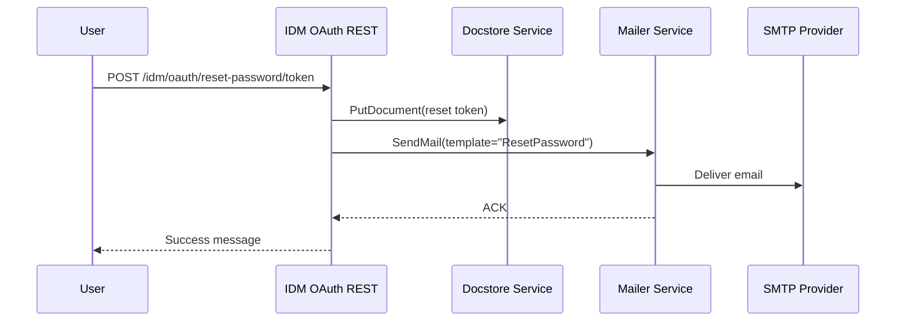

# Pydio Cells Architecture

## Runtime Composition

- `main.go` wires every micro-service at startup by importing their packages; each package registers itself with `runtime.Register` and `service.NewService`, which exposes gRPC, REST or HTTP endpoints (for example `gateway/restv2/service/service.go` and `idm/oauth/rest/service/service.go`).
- Service metadata and lifecycle are handled by `common/service/service.go`, which pushes registrations into the discovery registry (`discovery/registry/service/service.go`) so other components can resolve them via the shared runtime context.
- Shared clients (e.g. `common/client/grpc.ResolveConn`) let services dial peers by logical name, keeping deployments dynamic and decoupled from concrete addresses.

## Service Groups

| Group | Responsibilities | Key Packages | Interfaces |
| --- | --- | --- | --- |
| Gateway | Terminates HTTP(S), REST v2 APIs, WebDAV, WOPI and WebSocket bridges. Dispatches user requests towards backing services via gRPC clients. | `gateway/restv2`, `gateway/dav`, `gateway/data`, `gateway/websocket/service`, `gateway/wopi` | REST, WebSocket, gRPC |
| Frontend | Serves the single-page application and static assets, proxies OpenAPI docs. | `frontend/web/service`, `frontend/rest/service` | HTTP, REST |
| Discovery | Provides configuration, registry and install/update endpoints. Keeps Envoy/xDS snapshots for service routing. | `discovery/registry/service`, `discovery/config/*`, `discovery/install/*`, `discovery/update/*` | gRPC, REST, Generic (xDS) |
| Identity & Access (IDM) | Manages users, roles, ACLs, OAuth flows and user metadata. | `idm/user/*`, `idm/role/*`, `idm/acl/*`, `idm/oauth/rest/handler.go` | gRPC, REST, Web |
| Data Plane | Handles filesystem hierarchy, metadata, search, versions and document store. Delegates to datasource drivers for actual storage (S3, SQL, MongoDB, Bolt). | `data/tree/*`, `data/meta/*`, `data/search/*`, `data/docstore/*`, `data/versions/*` | gRPC, REST |
| Datasources | Mount points over object backends; starts MinIO-compatible gateways and sync/index routines. | `data/source/objects/service/service.go`, `data/source/index/service`, `data/source/sync/service` | gRPC |
| Broker | Async services for activity feeds, chat, mailer and logging. Publishes domain events to the shared pub/sub. | `broker/activity/*`, `broker/chat/*`, `broker/mailer/*`, `broker/log/*` | gRPC, REST |
| Scheduler | Background jobs, tasks orchestration and timer-based triggers. | `scheduler/jobs/grpc/service`, `scheduler/tasks/grpc/service`, `scheduler/timer/service` | gRPC |

## Communications

- **Synchronous calls.** Edge handlers (`gateway/restv2/api.go`, `idm/oauth/rest/handler.go`) invoke backing services through gRPC clients by resolving peers with `common/client/grpc.ResolveConn`. Tree and metadata CRUD funnel through the composed client in `common/nodes/compose`, which in turn proxies to the tree gRPC service (`data/tree/grpc/handler.go`).
- **Datasource bridging.** Tree mutations route to datasource drivers. For instance `scheduler/jobs/userspace/userspace.go` calls `router.CreateNode` and `router.PutObject`; `data/tree/grpc/handler.go` hydrates datasources and delegates content writes to the objects service (`data/source/objects/service/service.go`), which spins up MinIO handlers per datasource.
- **Event bus.** Services publish domain events to `common/broker` using Go Cloud pub/sub backends (NATS, RabbitMQ, in-memory – imported in `main.go`). Tree changes go through `common.TopicTreeChanges`; subscribers include the WebSocket gateway (`gateway/websocket/service/service.go`), scheduler task queues (`scheduler/tasks/subscriber.go`), ACL caches (`idm/acl/grpc/service/service.go`) and indexers (`data/search/grpc/search_server.go`).
- **Service discovery.** Each `service.Service` registers with the registry during startup; the registry maintains xDS snapshots (`discovery/registry/service/service.go`) and feeds routing data to gateways.
- **Shared storage and caches.** Storage drivers are plugged via `common/storage/*` and caches via `common/utils/cache/*`. Event subscribers (e.g. `data/tree/grpc/subscriber.go`) reconcile move events using shared caches before rebroadcasting.

## Sequence Diagrams

### Node creation through the REST gateway

The flow below follows `gateway/restv2/api-create.go` and `scheduler/jobs/userspace/userspace.go`, which leverage the tree gRPC service to materialize nodes and objects in datasource backends.

### Event propagation to connected clients

`data/tree/grpc/subscriber.go` publishes node change events, while `gateway/websocket/service/service.go` subscribes and forwards updates to WebSocket consumers.

### Password reset and notification

The OAuth token handler (`idm/oauth/rest/handler.go`) coordinates docstore and mailer services to deliver reset instructions.

## Additional Notes

- Scheduler actions (`scheduler/actions/*`) react to job definitions stored through the jobs service and may trigger tree or IDM operations, reusing the same gRPC clients as the gateway.
- The registry also exposes xDS and Istio Route objects (`discovery/registry/service/service.go`) so sidecars or edge proxies can dynamically learn upstream endpoints.
- Datasource services watch configuration changes via `watch.WithPath` (see `data/source/objects/service/service.go`) to start/stop MinIO gateways without restarting the process.
